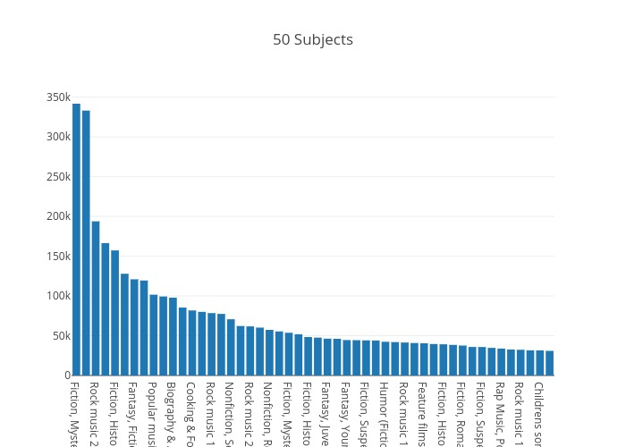

# Are E-Books Overtaking Printed Books at the SPL?

This <a href='https://data.seattle.gov/Community/Checkouts-by-Title/tmmm-ytt6'>data set </a> is made available through the Open Data Program by the City of Seattle; it consists of monthly counts by title of checkout for all physical and digital items from 2005 to present from the Seattle Public Library. The set is updated at the beginning of each month; as of March 2019 it contained more than 33 million of entries with 11 columns. Each row is a checkout count with the following information: 

 

<table style="width:80%">
  <tr>
    <th>Column Name</th>
    <th>Description</th> 
    <th>Data Type</th>
  </tr>
  <tr>
    <td>UsageClass</td>
    <td>Denotes if item is “physical” or “digital”</td>
    <td>text</td>
  </tr>
  <tr>
    <td>CheckoutType</td>
    <td>Denotes the vendor tool used to check out the item</td>
    <td>text</td>
  </tr>
  <tr>
    <td>MaterialType</td>
    <td>Describes the type of item checked out (examples: book, song movie, music, magazine)</td>
    <td>text</td>
  </tr>
  <tr>
    <td>CheckoutYear</td>
    <td>The 4-digit year of checkout for this record</td>
    <td>number</td>
  </tr>
    <tr>
    <td>CheckoutMonth</td>
    <td>The month of checkout for this record</td>
    <td>number</td>
  </tr>
    <tr>
    <td>Checkouts</td>
    <td>A count of the number of times the title was checked out within the “Checkout Month”</td>
    <td>number</td>
  </tr>
    <tr>
    <td>Title</td>
    <td>The full title and subtitle of an individual item</td>
    <td>text</td>
  </tr>
    <tr>
    <td>Creator</td>
    <td>The author or entity responsible for authoring the item</td>
    <td>text</td>
  </tr>
    <tr>
    <td>Subjects</td>
    <td>The subject of the item as it appears in the catalog</td>
    <td>text</td>
  </tr>
    <tr>
    <td>Publisher</td>
    <td>The publisher of the title</td>
    <td>text</td>
  </tr>
    <tr>
    <td>PublicationYear</td>
    <td>The year from the catalog record in which the item was published, printed, or copyrighted.</td>
    <td>text</td>
  </tr>
</table>

## Question: Are digital books challenging printed books in the Seattle Public Library?

The Seattle Public Library has been recording all digital and physical checkouts since April 2005 and has over 33.4 million of entries which get updated every month, the library also offers and promotes a wide collection of e-books and audiobooks that are available for multiple devices.

With this analysis I compare and try to predict checkout formats for the SPL
  

## Methodology

OSEMiN

<b>Obtain</b> Gather information, obtain the data.

<b>Scrub</b> Clean, reduce noise, remove data that is not needed; check, remove or replace missing or null values, extract columns or format data types.

<b>Explore</b> Set up the data, check for multicollinearity, make sure the dataset meets what is necessary for the type of model to apply later on.

<b>Model</b> Implement supervised or unsupervised algorithms.

<b>Interpret</b> Evaluate the results.

## Initial Findings
Over the past decade digital content has made a valiant effort at catching up.

    

    

Sound Disc comes second with 3.87M of checkouts; e-books have been checkout 3.6M times.

    

Library users are constant for all months during the year

### Most Checkout Titles in the last 6 months

 Becoming Michelle Obama was top of the list for the first two months of 2019

    

  Juvenile Fiction makes number 6 in the list of the top 50, may be an indication that teenagers are still reading...

### Most Checkout Authors

 James Patterson, Agatha Christie and Stephen King are top of the list!

## Classification and Predictions

Supervised learning is when we want to predict a certain outcome from a given input and the goal is to train a model that can make accurate predictions for new, never-seen before data. To answer the initial question of classifying digital and physical checkouts I have used a Logistic Regression model.

The most important features that the classifier takes into account are:

- <b>Checkout type:</b> the tool used to check out an item, the SPL has 5 different tools
 - Freegal: stream and download songs
 - OverDrive: access e-books and audiobooks
 - Horizon: information portal used by the library previously
 - Hoopla: stream movies or TV shows
 - Zinio: digital magazines
- <b>Checkout year</b>
- <b>Creator: </b>the author or entity responsible for authoring the item.
- <b>Subjects: </b>there are over 788,000 different subjects.
- <b>Publication year:</b> the year in which the item was published, printed, or copyrighted.
- <b>_check_eq_publ:</b> this column describes if the title was checked out the same year it was published.

### Counts of correct and incorrect classification

To apply the algorithm I took a random sample from the original set with 'entries without replacement' to avoid choosing any entry more than once. The matrix below is a summary of prediction results on our classification problem.

 

* Total number of digital counts (0) is 15,010
* Total number of physical counts (1) is 15,185
* Correct values predicted by the model: 25,533 
* More errors were made by predicting physical counts (4,633) than predicting digital counts (299)

## Conclusions and Recomendations

* Printed books remain the most popular means of reading.
* The model can predict digital counts slightly better.
* The data schema needs to be reorganized. 
    * There are more than 788 thousand subjects which can be reduce to a smaller number of categories. 
    * Duplicates made due to possible manual entries: William Shakespeare, Shakespeare William, Shakespeare.  
    
### Future work
* Since the author and creator columns have many duplicates, I'd like to manipulate those strings to find the most common names and get a better sense of these entries.
* Make a different target and apply other algorithms.    

## Sources

* https://towardsdatascience.com/understanding-feature-engineering-part-2-categorical-data-f54324193e63
* https://stackoverflow.com/questions/48697770/xgboost-model-consistently-obtaining-100-accuracy
* https://machinelearningmastery.com/tactics-to-combat-imbalanced-classes-in-your-machine-learning-dataset/
* https://machinelearningmastery.com/classification-accuracy-is-not-enough-more-performance-measures-you-can-use/
* https://stats.stackexchange.com/questions/369428/deciding-between-get-dummies-and-labelencoder-for-categorical-variables-in-a-lin
* https://discuss.analyticsvidhya.com/t/label-encoding-vs-one-hot-encoding-in-machine-learning-model/7411
* https://www.analyticsvidhya.com/blog/2016/03/complete-guide-parameter-tuning-xgboost-with-codes-python/
* https://stackoverflow.com/questions/22137723/convert-number-strings-with-commas-in-pandas-dataframe-to-float
* https://realpython.com/python-data-cleaning-numpy-pandas/
* Andreas C. Müller & Sarah Guido. Introduction to Machine learning with Python. 2017
* Jake VanderPlas. Python Data Science Handbook. 2016
